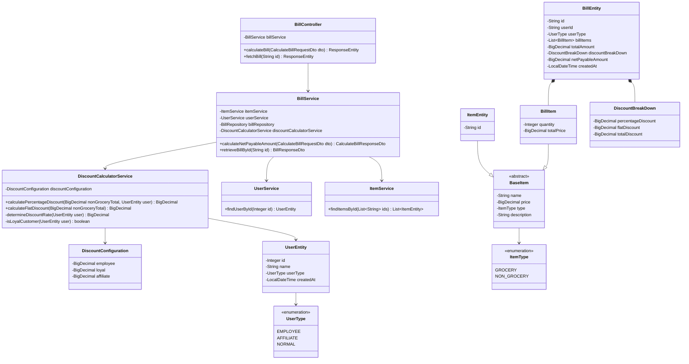

# Bill Calculator Application

A retail store billing system built with Spring Boot that calculates net payable amounts based on items purchased, user types, and configurable discount rules.

---

## Table of Contents

- [Overview](#overview)
- [Technology Stack](#technology-stack)
- [Architecture](#architecture)
- [Business Logic](#business-logic)
- [Project Structure](#project-structure)
- [Configuration](#configuration)
- [API Endpoints](#api-endpoints)
- [Running the Application](#running-the-application)
- [Testing](#testing)
- [Code Quality](#code-quality)

---

## Overview

The Bill Calculator is a Spring Boot application that manages retail billing operations with a sophisticated discount calculation system. It supports multiple user types (employees, affiliates, and regular customers) and applies different discount rules based on user privileges and item categories.

### Key Features

- **Multi-User Type Support**: Different discount rates for employees, affiliates, and loyal customers
- **Item Categorization**: Separate handling for grocery and non-grocery items
- **Dual Discount System**: Percentage-based and flat discounts applied strategically
- **Polyglot Persistence**: PostgreSQL for user data, MongoDB for bills and items
- **API Key Authentication**: Secured endpoints with custom API key-based security
- **Comprehensive Testing**: Unit tests with JaCoCo code coverage reporting

---

## Technology Stack

### Core Framework
- **Spring Boot 4.0.6** - Main application framework
- **Java 21** - Programming language

### Data Persistence
- **Spring Data JPA** - User data persistence
- **PostgreSQL** - Relational database for user entities
- **Spring Data MongoDB** - Document-based persistence
- **MongoDB** - NoSQL database for bills and items

### Security & Validation
- **Spring Security** - API authentication and authorization
- **Spring Validation** - Request/response validation

### Development Tools
- **Lombok** - Boilerplate code reduction
- **Spring DevTools** - Hot reload during development
- **Maven** - Build and dependency management

### Code Quality & Testing
- **JUnit 5** - Unit testing framework
- **Mockito** - Mocking framework
- **JaCoCo** - Code coverage analysis
- **Checkstyle** - Static code analysis (Google Java Style Guide)

---

## Architecture

The application follows a layered architecture with clear separation of concerns:

```
┌─────────────────────────────────────────────────────────┐
│                    Controller Layer                      │
│              (REST API Endpoints)                        │
└──────────────────────┬──────────────────────────────────┘
                       │
┌──────────────────────▼──────────────────────────────────┐
│                    Service Layer                         │
│     (Business Logic & Orchestration)                     │
│  - BillService                                           │
│  - DiscountCalculatorService                             │
│  - UserService                                           │
│  - ItemService                                           │
└──────────────────────┬──────────────────────────────────┘
                       │
┌──────────────────────▼──────────────────────────────────┐
│                  Repository Layer                        │
│              (Data Access)                               │
│  - UserRepository (JPA/PostgreSQL)                       │
│  - BillRepository (MongoDB)                              │
│  - ItemRepository (MongoDB)                              │
└─────────────────────────────────────────────────────────┘
```

### UML Class Diagram



---

## Business Logic

### Discount Calculation Rules

The application implements a sophisticated two-tier discount system:

#### 1. Percentage-Based Discount (Applied to Non-Grocery Items Only)

The system applies **only one** percentage discount per transaction based on user type priority:

| User Type | Discount Rate | Conditions |
|-----------|---------------|------------|
| **Employee** | 30% | Always applied for employee users |
| **Affiliate** | 10% | Applied for affiliate users |
| **Loyal Customer** | 5% | Applied to NORMAL users who have been customers for ≥ 2 years |
| **Regular Customer** | 0% | New NORMAL users (< 2 years) |

**Priority**: Employee > Affiliate > Loyal Customer > Regular Customer

#### 2. Flat Discount (Applied to Non-Grocery Items Only)

- **5 for every 100** spent on non-grocery items
- Calculated **after** percentage discount is applied
- Uses integer division (e.g., $250 → $10 discount, $299 → $10 discount)

#### 3. Item Type Exclusions

- **Grocery items**: No discounts applied (neither percentage nor flat)
- **Non-grocery items**: Both discount types applicable

### Calculation Flow

```
1. Separate items into GROCERY and NON_GROCERY categories
2. Calculate total for each category
3. Apply percentage discount to NON_GROCERY total based on user type
4. Apply flat discount to NON_GROCERY total
5. Combine discounts with GROCERY total
6. Generate final bill with breakdown
```

### Example Calculation

**Scenario**: Employee purchasing items worth $950

- Grocery items: $200
- Non-grocery items: $750

**Calculation**:
1. Percentage discount (30% on $750): **$225**
2. Remaining non-grocery total: $750 - $225 = $525
3. Flat discount ($5 per $100 of original $750): **$35**
4. Net payable: $200 (grocery) + $525 (non-grocery after percentage) - $35 (flat) = **$690**

**Discount Breakdown**:
- Percentage Discount: $225
- Flat Discount: $35
- Total Discount: $260
- Net Payable Amount: $690

---

## Project Structure

```
retail-store-billing/
│
├── src/
│   ├── main/
│   │   ├── java/com/retailstore/billing/
│   │   │   ├── config/                      # Configuration classes
│   │   │   │   ├── ApiKeyAuthFilter.java    # API key authentication filter
│   │   │   │   ├── DiscountConfiguration.java # Externalized discount rates
│   │   │   │   ├── PersistenceConfiguration.java # Database configuration
│   │   │   │   └── SecurityConfiguration.java # Security setup
│   │   │   │
│   │   │   ├── controller/                  # REST Controllers
│   │   │   │   └── BillController.java      # Bill calculation & retrieval endpoints
│   │   │   │
│   │   │   ├── dto/                         # Data Transfer Objects
│   │   │   │   ├── BillItemDto.java
│   │   │   │   ├── BillResponseDto.java
│   │   │   │   ├── CalculateBillRequestDto.java
│   │   │   │   └── CalculateBillResponseDto.java
│   │   │   │
│   │   │   ├── exception/                   # Exception handling
│   │   │   │   ├── BillNotFoundException.java
│   │   │   │   ├── GlobalExceptionHandler.java
│   │   │   │   ├── ItemNotFoundException.java
│   │   │   │   └── UserNotFoundException.java
│   │   │   │
│   │   │   ├── model/                       # Domain models
│   │   │   │   ├── enums/
│   │   │   │   │   ├── ItemType.java        # GROCERY / NON_GROCERY
│   │   │   │   │   └── UserType.java        # EMPLOYEE / AFFILIATE / NORMAL
│   │   │   │   ├── jpa/
│   │   │   │   │   └── UserEntity.java      # PostgreSQL user entity
│   │   │   │   └── mongo/
│   │   │   │       ├── BaseItem.java        # Abstract item base class
│   │   │   │       ├── BillEntity.java      # Bill document
│   │   │   │       ├── BillItem.java        # Bill line item
│   │   │   │       ├── DiscountBreakDown.java # Discount details
│   │   │   │       └── ItemEntity.java      # Item catalog document
│   │   │   │
│   │   │   ├── repository/                  # Data access layer
│   │   │   │   ├── jpa/
│   │   │   │   │   └── UserRepository.java  # PostgreSQL repository
│   │   │   │   └── mongo/
│   │   │   │       ├── BillRepository.java  # MongoDB bill repository
│   │   │   │       └── ItemRepository.java  # MongoDB item repository
│   │   │   │
│   │   │   ├── service/                     # Business logic
│   │   │   │   ├── BillService.java         # Bill calculation orchestration
│   │   │   │   ├── DiscountCalculatorService.java # Discount computation
│   │   │   │   ├── ItemService.java         # Item retrieval
│   │   │   │   └── UserService.java         # User retrieval
│   │   │   │
│   │   │   └── BillCalculatorApplication.java # Application entry point
│   │   │
│   │   └── resources/
│   │       └── application.yaml             # Application configuration
│   │
│   └── test/                                # Unit tests (mirrors main structure)
│
├── pom.xml                                  # Maven configuration
└── README.md                                # This file
```

---

## Configuration

### Application Properties

Configuration is managed via `application.yaml` with environment variable support:

```yaml
# Database Configuration
PG_DB_HOST: localhost          # PostgreSQL host
PG_DB_PORT: 5432               # PostgreSQL port
PG_DB_NAME: retail_db          # PostgreSQL database name
PG_DB_USER: admin              # PostgreSQL username
PG_DB_PASSWORD: admin123       # PostgreSQL password

MG_DB_HOST: localhost          # MongoDB host
MG_DB_PORT: 27017              # MongoDB port
MG_DB_NAME: retail_db          # MongoDB database name
MG_DB_USER: admin              # MongoDB username
MG_DB_PASSWORD: admin123       # MongoDB password

# Discount Configuration (as decimals)
EMPLOYEE_DISCOUNT: 0.30        # 30% for employees
AFFILIATE_DISCOUNT: 0.10       # 10% for affiliates
LOYAL_CUSTOMER_DISCOUNT: 0.05  # 5% for loyal customers
NORMAL_CUSTOMER_DISCOUNT: 0.00 # 0% for new customers

# Security
API_KEY: secret-api-key        # API authentication key

# Profile
SPRING_PROFILE_ACTIVE: local   # Active profile (local)
```

### Database Setup

#### PostgreSQL
```sql
CREATE DATABASE retail_db;
-- Tables are auto-created via Hibernate DDL (ddl-auto: update)
```

#### MongoDB
```sql
use retail_db;
// Collections: bills, items
```

---

## API Endpoints

All endpoints require API key authentication via the `X-API-KEY` header.

### 1. Calculate Bill

Calculates the net payable amount for a bill with discount breakdown.

**Endpoint**: `POST /api/bills/calculate`

**Headers**:
```
X-API-KEY: secret-api-key
Content-Type: application/json
```

**Request Body**:
```json
{
   "userId": 1,
   "billItems": [
      {
         "itemId": "6640000000000000000000a1",
         "quantity": 5
      }
   ]
}
```

**Response** (200 OK):
```json
{
   "billId": "69ff38b0f7d215d972b98d77",
   "totalAmount": 6000,
   "netPayableAmount": 5700,
   "totalDiscount": 300,
   "discountBreakDown": {
      "percentageDiscount": 0,
      "flatDiscount": 300,
      "totalDiscount": 300
   }
}
```

### 2. Retrieve Bill

Fetches an existing bill by ID.

**Endpoint**: `GET /api/bills/{billId}`

**Headers**:
```
X-API-KEY: secret-api-key
```

**Response** (200 OK):
```json
{
   "id": "69ff4135e52fe8c538fe5673",
   "userId": "1",
   "userType": "NORMAL",
   "billItems": [
      {
         "description": "High performance laptop",
         "name": "Laptop",
         "price": 1200,
         "quantity": 5,
         "totalPrice": 6000,
         "type": "NON_GROCERY"
      }
   ],
   "totalAmount": 6000,
   "discountBreakDown": {
      "percentageDiscount": 0,
      "flatDiscount": 300,
      "totalDiscount": 300
   },
   "netPayableAmount": 5700,
   "createdAt": "2026-05-09T17:14:13.84"
}
```

**Error Responses**:
- `404 NOT FOUND`: Bill not found
- `401 UNAUTHORIZED`: Invalid or missing API key
- `400 BAD REQUEST`: Validation errors

---

## Running the Application

### Prerequisites

- **Java 21** or higher
- **Maven 3.6+**
- **Docker** 20.10+ and **Docker Compose** 2.0+ (for databases)

### Quick Start

1. **Clone the repository**:
   ```bash
   git clone <repository-url>
   cd retail-store-bill-calculator
   ```

2. **Start the databases using Docker Compose**:
   ```bash
   docker-compose up -d
   ```

   This will start:
   - **PostgreSQL** on port 5432 (database: `retail_db`)
   - **MongoDB** on port 27017 (database: `retail_db`)
   - **MongoDB**: Automatically loads `mongo/init.js` initialization script

3. **Run the application using Maven**:
   ```bash
   mvn spring-boot:run
   ```

4. **Application will be available at**: `http://localhost:8080`

---

### Database Initialization

When running with Docker Compose:

- **PostgreSQL**: The `script.sql` file will be executed automatically when the application starts with the **`local` profile** (default)
- **MongoDB**: The `mongo/init.js` script is loaded during MongoDB container initialization to insert list of predefined items.

Both initialization scripts populate the databases with sample data for testing.

---

### Docker Commands

```bash
# Start databases
docker-compose up -d

# Stop and remove all data (fresh start)
docker-compose down -v
```

---

### Architecture

```
┌─────────────────────────────────────────────────┐
│         billing (Spring Boot)                   │
│         Running via Maven (Port: 8080)          │
│              Profile: local                     │
└──────────────┬──────────────┬───────────────────┘
               │              │
       ┌───────▼──────┐  ┌────▼──────────┐
       │  PostgreSQL  │  │   MongoDB     │
       │  Port: 5432  │  │  Port: 27017  │
       │  retail_db   │  │   retail_db   │
       │  (Docker)    │  │   (Docker)    │
       └──────────────┘  └───────────────┘
```

**Architecture Notes**:
- Application runs on the host machine via Maven
- Databases run in Docker containers
- Persistent volumes ensure data retention across container restarts
- Health checks monitor database availability

---

### Environment Variables (Optional)

The application uses default values that work with Docker Compose. To customize:

```bash
# Database Configuration (defaults work with docker-compose)
export PG_DB_HOST=localhost
export PG_DB_PORT=5432
export PG_DB_NAME=retail_db
export PG_DB_USER=admin
export PG_DB_PASSWORD=admin123

export MG_DB_HOST=localhost
export MG_DB_PORT=27017
export MG_DB_NAME=retail_db
export MG_DB_USER=admin
export MG_DB_PASSWORD=admin123

# Discount Configuration
export EMPLOYEE_DISCOUNT=0.30
export AFFILIATE_DISCOUNT=0.10
export LOYAL_CUSTOMER_DISCOUNT=0.05

# Security
export API_KEY=secret-api-key
```

See [Configuration](#configuration) section for all available variables.

---

## Testing

The project includes comprehensive unit tests for all layers.

### Run Tests

```bash
# Run all tests
mvn test

# Run tests with coverage report
mvn clean test

# View coverage report
# Open: target/site/jacoco/index.html
```

### Test Coverage

JaCoCo generates detailed coverage reports showing:
- Line coverage
- Branch coverage
- Method coverage
- Class coverage

### Test Structure

Tests mirror the main source structure:
- `BillControllerTest` - Controller layer tests
- `BillServiceTest` - Service layer tests with mocked dependencies
- `DiscountCalculatorServiceTest` - Discount logic validation
- `UserServiceTest`, `ItemServiceTest` - Repository interaction tests

---

## Code Quality

### Checkstyle

Static code analysis using Google Java Style Guide:

```bash
# Run checkstyle
mvn checkstyle:check

# Generate checkstyle report
mvn checkstyle:checkstyle
```

### Lombok

The project uses Lombok to reduce boilerplate:
- `@Data` - Getters, setters, toString, equals, hashCode
- `@AllArgsConstructor`, `@NoArgsConstructor` - Constructors
- `@Slf4j` - Logging
- `@Builder` - Builder pattern (where applicable)

Ensure Lombok plugin is installed in your IDE.

---
